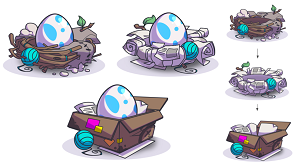
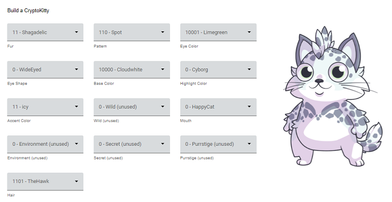

> - Does anyone buy anymore? Had this kitties for years. Anyone wanna buy?
> - I have 340 kitties... and I wanna bulk SELL
> - Kitties since 2017. How much does it value right now? Wanna SELL
> - How much should I sell my gen 0 cat for?
> - I stupidly bought these little bastards. Have 6, what's the best thing to do with them - any chance of making any of my lost money back?
> - Pricing help? How much are my kitties worth?
> - I put these kitties up for sale. Can you please tell me if my pricing is right.
> - Can someone help me sell my cats?
> - Are these kittens worth anything?
> 
> -- [CryptoKitties](https://www.reddit.com/r/CryptoKitties)

# CryptoKitties - What's News?

## 2021

### CryptoKitties v2.0 - From Ethereum to Flow (Blockchain) - Build In Public

> On Ethereum, your CryptoKitties live in the storage area associated with the CryptoKitties contract, 
> and they have a data field to track who owns them.
>
> On Flow, your CryptoKitties will live in the storage area associated with YOUR account...
> 
> -- [Dieter Shirley, Co-Creator CryptoKitties, Creator Flow @ Dapper Labs](https://twitter.com/dete73/status/1301217801101807616)

> Welcome to the early stages of our grand meowgration to Flow. 
> We want to enable mainstream adoption of the mascot of blockchain through free to play, new mechanics, 
> upgradable smart contracts, easy on-boarding, fewer limitations and restrictions, 
> and yes, fully composable, extensible on-chain layer one Kitties with true utility.
> Phew, that was a lot but every bit of it matters.
>
> Our vision is to inspire the world to collect CryptoKitties.
>
> This board will contain ideas, implementations, and designs of all the new features we want to test and potentially bring to Flow.
> Let's put lot of emphasis on the word "test". These features are in various stages of development 
> as we work towards building the closed alpha of CryptoKitties on Flow. 

[CryptoKittes on Flow (Blockchain) Board - Build in Public](https://trello.com/b/MVwdMAn7/ck-on-flow-build-in-public)
- [Intrinsic Genes & Nests](https://trello.com/c/89DL79It/25-intrinsic-genes)
  - > Intrinsic genes modify the breeding and genetic properties of CryptoKitties and occupy 4 loci in a Kitty's genome.
    > Types of intrinsic genes:
    > 
    > Breeding Properties:
    > - Vigor: modifies breeding time
    > - Fecundity: modifies Catpacity
    >
    > Genetic Properties:
    > - Mutability: modifies both base mutation and devolution probability
    > - Penetrance: modifies rate of recessive emergence (gene swaps within a Locus)
- [Gene Science](https://trello.com/c/ROGqDiMM/20-gene-science)
  - > The Gene Science contract is responsible for the genetic structure of Kitties. 
    > Unlike CryptoKitties' math-based mutation pyramid, Gene Science on Flow uses a queryable lookup table to enforce breeding 
    > logic for mutating pairs.
    > 
    > Every known legacy mutation will be ported over to CryptoKitties on Flow and locked forever. 
    > While legacy mutations will remain untouched, we do want your Jaguar to be able to mutate 
    > with new CK on Flow genes while retaining its legacy mutation.
    >
    > A gene size of 10 bits will allow for 2^10 potential genes in a single locus.
    > 25 loci make up the CryptoKitties genome with the first 12 being reserved for legacy loci. 
    > We've also made changes in the technical implementation of mixgenes and the core Kitty structure to allow backwards compatibility.
- [Breeding with Nests](https://trello.com/c/1LvC0fF0/33-breeding-with-nests)
  - > Nests are consumable NFTs required in breeding. To breed a pair of Kitties, you'll need one Nest and available 
    > Cat-pacity from a parent. Upon breeding, an Egg NFT is created and placed within your chosen Nest which can be hatched at a later time.
    >
    > Nests have their own genes which can affect the breeding or genetic outcome of your Kitties.
    > Not all of these properties are included in-scope.
    >
    > - Level: Maximum Level of Cat born in this nest
    > - Nestpacity: Number of times the nest can be used before disintegration
    > - Durability: Probability that the nest does not consume Nestpacity on a breed

<!-- break -->

**CryptoKitties v2.0 (Flow Edition) Designer**

New Cattributes! - CryptoKitties on Flow - Render (Design) Your Own Kitty - <https://ck-renderer.herokuapp.com/>

**Kitty Items - Hats on Cats!**

> The CryptoKitties NFTs can continue on Ethereum while being equipped by Hats
> that are NFTs on Flow – they will claim their hats upon traveling over.

Hats on Cats! - Sample CryptoKitties App for Flow - Source: <http://github.com/onflow/kitty-items>

> Q: What is Kitty Items?
>
> Kitty Items, a project that demonstrates the current best practices for building decentralized app on flow.
>
> Items are hats for your cats, but under the hood they're non-fungible tokens stored on the flow blockchain.
>
> Items can be purchased from the marketplace with fungible tokens. 
> In the future you'll be able to add them to Ethereum CryptoKitties with ownership validated by an oracle.

Articles:
- [CryptoKitties: Getting in the Flow - Blockchain’s favorite mascot is making moves](https://www.cryptokitties.co/blog/post/cryptokitties-on-flow/) - Official CryptoKitties on Flow Announcement

### Ethereum Gas Price - All Time High - Transaction Fees
  
  
> Birthing fees are pretty high.
> I would like to breed but i saw the transaction free / cost which are at $1000. 
>
> I'm trying to buy one, and set the gas price to slow (1hr). Over three hours later, and up to $8.53 on gas & still no cat. 
> Is the game doomed?
> Update! The transaction took 6 hrs & 15 min. - but it did finally go through.
>
> Fees are exceptionally high now due to Ethereum's high price and movements. 
> The gas fees are tied to Ether (ETH) therefore high prices.
>
> Probably stuck with my cats forever... jeez, I hate to think of how much they cost in dollars with ether (ETH) as expensive as it is now.
>
> How much gas limit should I use to Adopt a Cat?
> The recommended gas limit in meta mask is absurd and the transaction 
> fee would be like $800, how much should i use?
>
> Gas prices [on Ethereum] have now nearly completely stopped the market. 
> I know there's plans to revitalize CryptoKitties [on Flow].

  
<!--  
### Promotions, Promotions, Promotions  
  -->
  
  
## 2020

### Wrapped Gen-0 CryptoKitties (WG0),  Wrapped Virgin Gen-0 CryptoKitties (WVG0) 

> The Wrapped Gen-0 contract ($WG0) is now the biggest holder of Gen-0 CryptoKitties -- [(Oct 9, 2020)](https://twitter.com/Poopie_cat/status/1315340687634690050)

- <https://www.wrappered.com>
  - <https://www.wrappered.com/faqs.html>
 
> Q: How is Wrapped Gen-0 and Wrapped Virgin Gen-0 different than Wrapped CryptoKitties?
>
> There is a fixed cap of 50,000 Gen-0 Kitties whereas non-Gen-0 Kitties can be bred indefinitely.

Price History:

Wrapped Gen-0 ($WG0):
- <https://www.coingecko.com/en/coins/wrapped-gen-0-cryptokitties>
- 2021/02/05 - 0.1275 ETH (~$208.26) / Circulating Supply: 1,908 

Wrapped Gen-0 ($WVG0):
- 2021/02/05 - 0.2653 ETH / Circulating Supply: 316

Todos: 
- Add contract?

## 2019

### Wrapped CryptoKitties  (WCK)

> $WCK wrapped cryptokitties; its actually backed by a digital cat; where as other coins are backed by hot-air.
>
> Do you want to collateralise your CDP (Collateralized Debt Position), with yDAI (Yield Zero-Coupon Bond DAI) 
> leveraged CHAI (Wrapper over the DAI Savings Rate), 
> which you can flash loan to your synthetic USD to buy your wrapped cryptokitties?

Turn unique non-fungible tokens into a fungible token.

How? Tokens (ERC20 on Ethereum) each backed 1:1 by an CryptoKitty (ERC721 on Ethereum)

- <https://wrappedkitties.com>

> The new thing is cryptokitties wrapped in a newly minted token, 
> that's being traded on a unicorn-themed exchange.

Buy $WCK on Uniswap with $ETH
- <https://info.uniswap.org/pair/0x2174e6d76fe8fa6602db6af86f5e17840bdb0760>

Price History:

> In 24 hours, almost 2,000 CryptoKitties
> have been wrapped into $WCK tokens raising the floor price of Kitties by 50% Chart with upwards trend  -- [(June 12, 2019)](https://twitter.com/Poopie_cat/status/1138813558165102592)

Wrapped CryptoKitty ($WCK):
- 2021/02/05 - 0.0018 ETH / Circulating Supply: 65,612
- add prices here 

Todos: 
- Check year of contract start? 
- Add contract? - <https://etherscan.io/address/0x09fE5f0236F0Ea5D930197DCE254d77B04128075#contracts>

<!--
### Promotions, Promotions, Promotions
-->

## Appendix

### Wrapped Kitties (WCK) Facts

> Every Wrapped CryptoKitty token is backed 1:1 by a CryptoKitty. 
> As Kitties are "wrapped" WCK is minted. Inversely, Kitties are transferred out of the contract when $WCK is burned
>
> To create a single $WCK, you'll need one CryptoKitty and two additional transactions. 
> At 100 gwei the approval tx costs ~0.005 ETH & wrapping tx ~0.013 for a total of 0.018 ETH each excluding the variable cost of the Kitty
>
> You can save on gas by batch wrapping cats. At 100 gwei, the tx fees to mint 30 $WCK totals ~0.34 ETH or roughly 0.011 ETH each
>
> $WCK supply is not fixed but the minting process is very laborious. 
> The theoretical max circulating supply is the total number of CryptoKitties which is currently 1.96m
>
> (Source: [$WCK Facts, Poppie Cat](https://twitter.com/Poopie_cat/status/1308847180745236483))

### Wrapped CryptoKitties Lite Pa-purr

> NFTs suffer from lack of liquidity and have a tendency to have high spreads. These issues along with additional 
> complexity of understanding their respective markets makes speculating on NFTs difficult. 
> Many investors are left to do their own research and figure out what others have had years to learn. 
> Investing in NFTs remains challenging due to their non-fungibility and transaction costs on ethereum.
>
> Wrapped CryptoKitties ($WCK) was the first experiment to convert NFTs into ERC20s to enable easy trading on exchanges like Uniswap. 
> With WCK, any CryptoKitty, regardless of market value, could be “wrapped” into a ERC-20 token. 
> This breakthrough allowed CryptoKitties players to convert over 50 thousand Kitties to gain access to liquid markets.
>
> Enter Wrapped Gen-0 ($WG0) CryptoKitties. The motivation behind WGO is to provide easy access to liquidity 
> for a more valuable asset class with fixed supply. Only 50,000 Generation 0 cats can ever exist and much less are in circulation. 
> WG0 is a modification of the original experiment, with the additional requirement that the wrapped CryptoKitty must be a scarce Generation 0 cat.
>
> Deflationary supply Generation 0s is another variant that remains interesting for collectors and speculators.
> This asset class is called Virgin Generation 0 and Wrapped Virgin Generation 0 ($WVG0). 
> These Kitties are of mint quality and must remain unbred to keep their virginity.
>
> There are only two ways to get a WG0 token: wrap an existing Gen 0 kitty that you own, or buy one from Uniswap. 
> A WG0 token is always backed exactly 1:1 with a Gen 0 kitty, and at any time a holder of 1 WG0 token can "burn" 
> the token and withdraw any Gen 0 from the WG0 contract. This creates unique opportunities to arbitrage between CryptoKitties' 
> first-party marketplace and the WG0 pool as well as the ability 
> to upgrade any Generation 0 you may own with any Generation 0 in the pool.
>
> (Source: [Wrapped CryptoKitties Lite Pa-purr](https://www.wrappered.com/litepapurr.html))

### What's Flow?

> Dieter Shirley, Co-Creator CryptoKitties, Creator Flow @ Dapper Labs:
>
>  Flow takes the best ideas from [Factbook's] Diem's MoveVM and combines them with 
>  a modern, ergonomic syntax inspired by Rust and Swift. 
>  We think it's a far better way to build digital assets.  -- [March 6, 2020](https://twitter.com/dete73/status/1235984369572966400)
>
>  The playground shows off our new smart contract language, Cadence. 
>  It pairs linear types with object capabilities to create a secure 
>  and declarative model for digital ownership. -- [March 6, 2020](https://twitter.com/dete73/status/1235984368822136833)

Links:
- Flow Playground @ <https://play.onflow.org>
- Flow Docs @ <https://docs.onflow.org>
- Flow Forum @ <https://forum.onflow.org>

